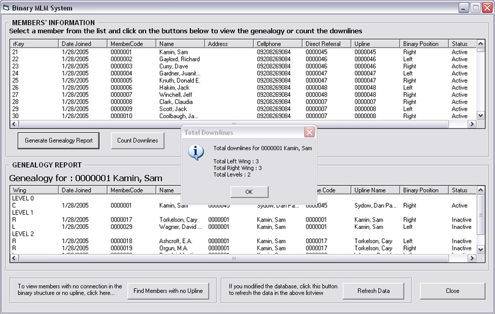



## Genealogy report for binary MLM system

### Description

This is a genealogy report generation for a binary structured multi-level marketing system.

The report is in listview, but stored in an array. The program is a little slow but there are

other ways to process the report faster. The program took 1 min. to process 678 members

(at 31 levels). It will work a lot slower if the all the nodes in the binary tree is full

(have 2 downlines each).

This program is dedicated to Ms. Sheryl L. Taripe. 2 (,") (",) 28
 
### More Info
 

             |
---                |---
**Submitted On**   |2005-09-08 22:08:14
**By**             |[Jerry Cacal](https://github.com/Planet-Source-Code/PSCIndex/blob/master/ByAuthor/jerry-cacal.md)
**Level**          |Intermediate
**User Rating**    |4.5 (18 globes from 4 users)
**Compatibility**  |VB 6\.0
**Category**       |[Miscellaneous](https://github.com/Planet-Source-Code/PSCIndex/blob/master/ByCategory/miscellaneous__1-1.md)
**World**          |[Visual Basic](https://github.com/Planet-Source-Code/PSCIndex/blob/master/ByWorld/visual-basic.md)
**Archive File**   |[Genealogy\_1931339102005\.zip](https://github.com/Planet-Source-Code/jerry-cacal-genealogy-report-for-binary-mlm-system__1-62505/archive/master.zip)

